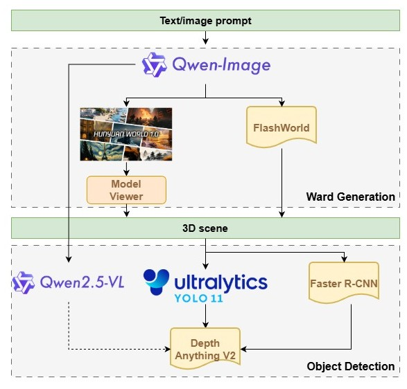

# Wardsim
WardSim is a generative simulation platform designed to support the development and training of humanoid nurse robots in realistic hospital environments.
It provides high-fidelity ward scene generation, configurable robot tasks, and multimodal interaction pipelines that enable researchers to simulate, test, and evaluate robotic behaviors before real-world deployment.

